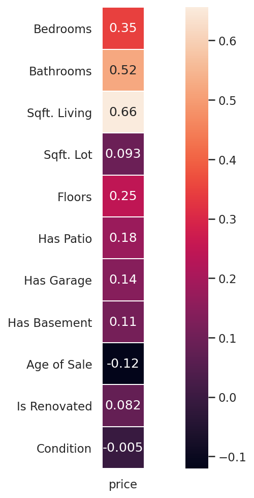
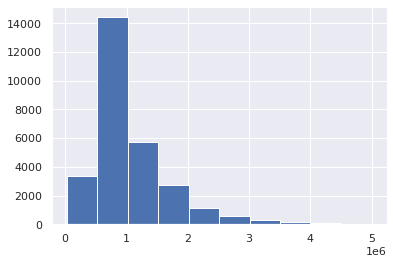
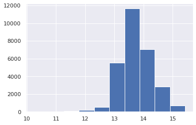
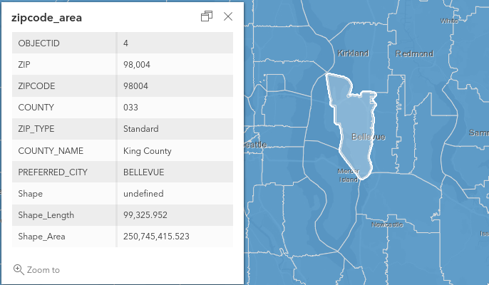
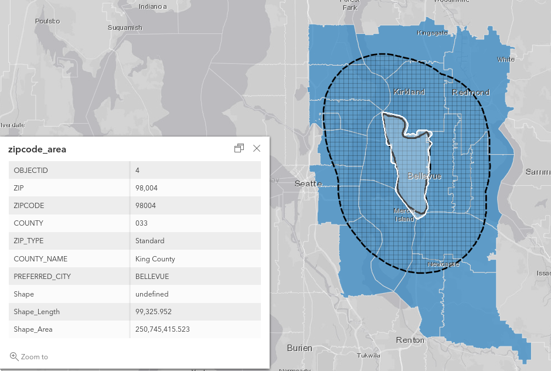
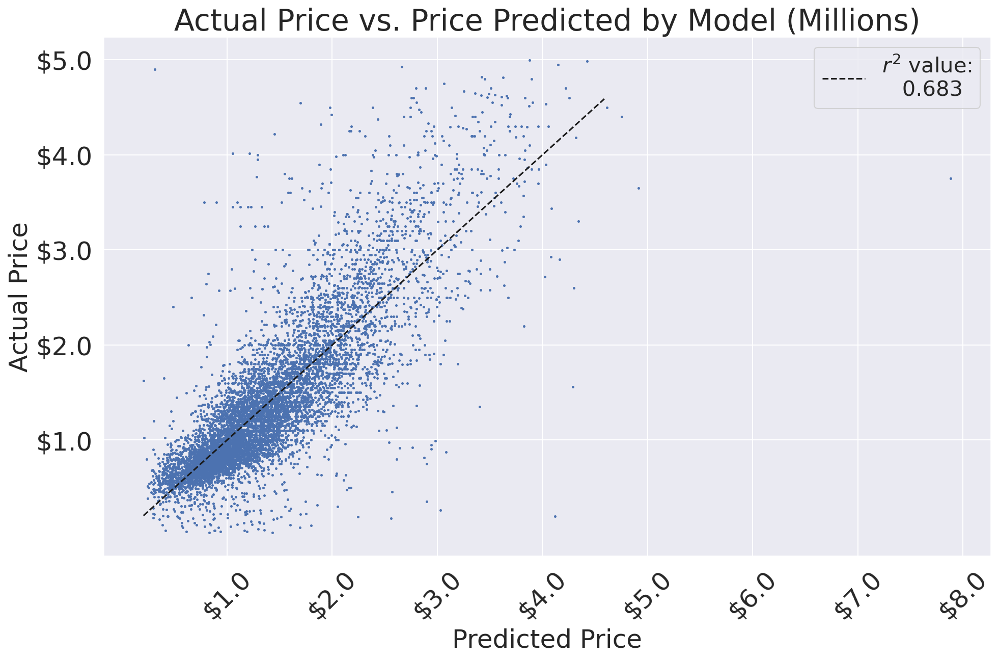
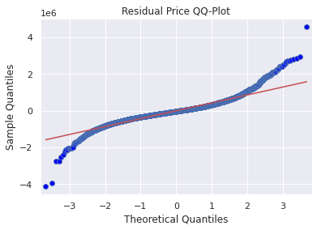
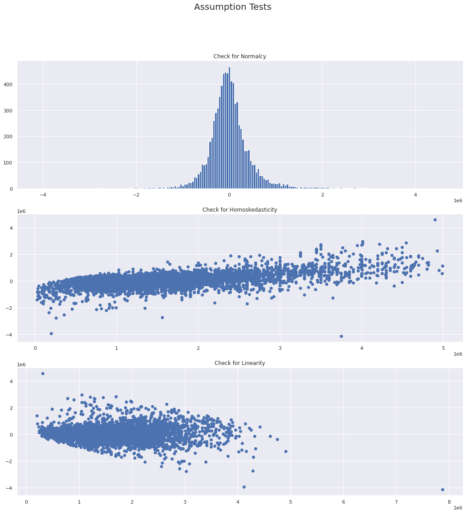
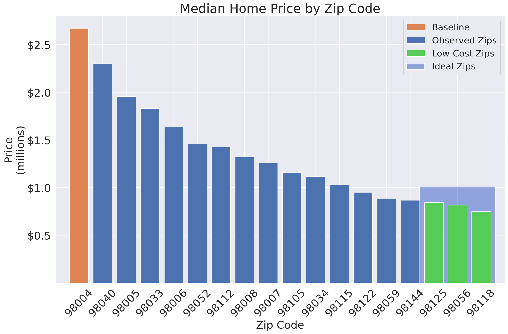
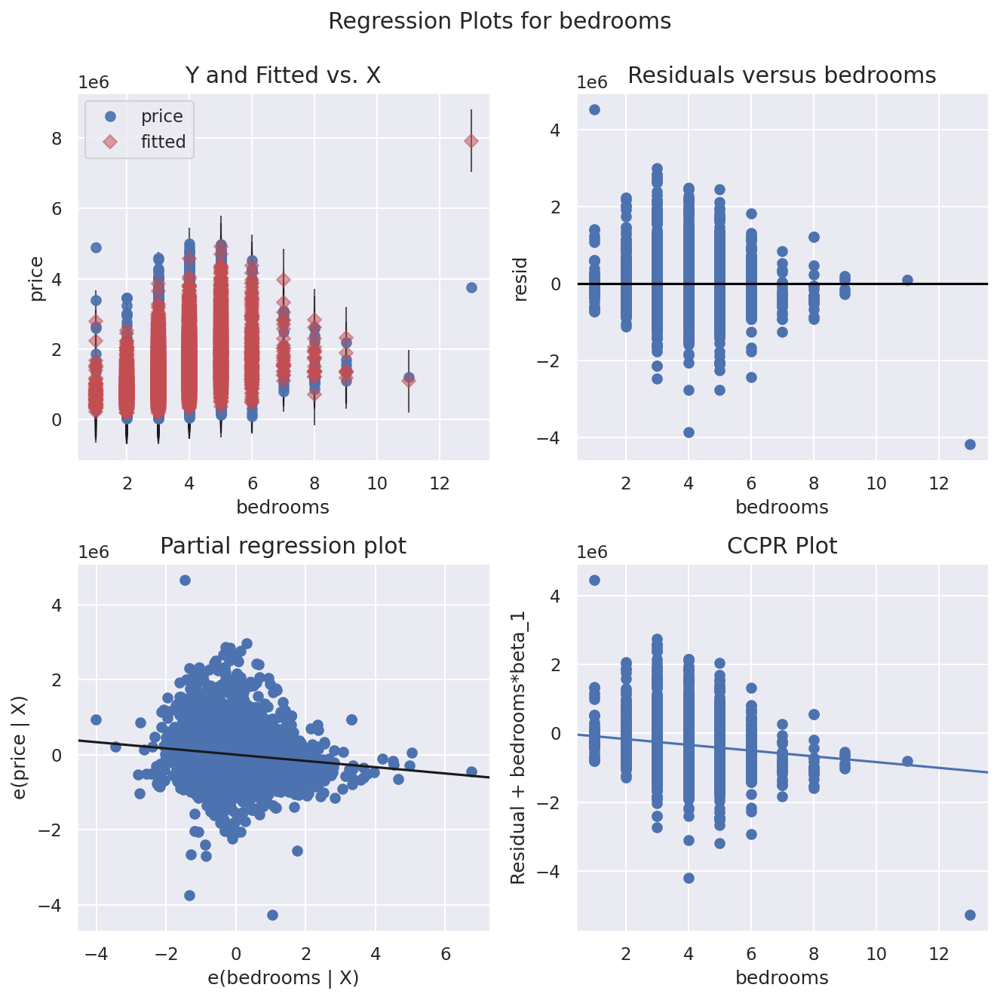

# King County Housing Investigation 

Explaining home pricing in King County, Washington through various regression models

By: Anat Jacobson and JD Mentz


--- 
## Overview 
Sales data of homes in King County from June 2021-June 2022 can provide valuable insights by investigating the houses' features. This information may be able to aid in the home-buying process for families or individuals looking to gain an understanding of what to expect when searching in the area.

# Introduction and Business Case
We are analyzing and creating a regression based on King County Home sales data. The stakeholders for this project is a typical American family looking to purchase a home within King County.  A portion of our data has been provided by the Flatiron School and we gathered some other data points from the king county public data base. These data sets had information regarding the state of the home, year built, whether it was renovated or not, square footage and various features of the home. Additonally we did a lot of data cleaning as will be seen in the Analysis below. 

Our conclusions after the below analysis include identifying:

1. What zip codes should you be looking to buy in based on Price that best fits you? 
2. What type of home with regards to bedrooms/size should you be looking to purchase? 


## Business Understandings:

### Applications:  
- Future King County residents want to make informed decisions when home shopping.
- There are many features that may be able to describe housing prices.

### Data:  
- House sales data from June 2021 to June 2022 - King County Assessor's office (provided by Flatiron School)
    - Contains some data from nearby zip codes as well
    - [kc_house_data.csv](data/kc_house_data.csv)
        - a detailed breakdown of this data is available [here: column_names.md](data/column_names.md)
- Zip code data - [zip-codes.com](https://www.zip-codes.com/county/wa-king.asp)
    - Used to cross-reference King County zip codes
    - [King_County_Zip_Codes.csv](data/King_County_Zip_Codes.csv)
- Regional GIS data - [King County GIS, Open Data](https://gis-kingcounty.opendata.arcgis.com/datasets/kingcounty::zipcodes-for-king-county-and-surrounding-area-zipcode-area/explore?location=47.637170%2C-122.142755%2C10.98)
    - Used to find zip codes in a proximity
    - [zips_5_mile.csv](data/zips_5_mile.csv)
### Methodology: 
Because of the litany of features that can influence home pricing, this project investigates features and their effects through multiple linear regression in an attempt to best describe variations within housing prices.  For the purposes of this analysis, we will be observing significance with a standard $\alpha$ of $\alpha=0.05$.

## Data Exploration and Analysis

Houses are nice, but we want to investigate **HOMES**.

We'll narrow down our scope to houses that are larger than 400sqft.<sup>[1](https://www.seattle.gov/documents/Departments/SDCI/Codes/SeattleResidentialCode/2018SRCAppendixQ.pdf)</sup>

We also are only interested in homes that meet the following criteria:
1. Must have **AT LEAST** 1 bedroom
2. Must have **AT LEAST** 1 bathroom
3. Must be worth less than $5,000,000 US.


<sub>[[1]](https://www.seattle.gov/documents/Departments/SDCI/Codes/SeattleResidentialCode/2018SRCAppendixQ.pdf)
: houses less than 400sqft are defined as _tiny homes_ per [Seattle residential code](
https://www.seattle.gov/documents/Departments/SDCI/Codes/SeattleResidentialCode/2018SRCAppendixQ.pdf)
</sub>

Here, we create a heatmap focused specifically on variables' effects on price

    


## Simple Models

### Running simple regression based on most correlated variable: sqft_living

<table class="simpletable">
<caption>OLS Regression Results</caption>
<tr>
  <th>Dep. Variable:</th>          <td>price</td>      <th>  R-squared:         </th>  <td>   0.430</td>  
</tr>
<tr>
  <th>Model:</th>                   <td>OLS</td>       <th>  Adj. R-squared:    </th>  <td>   0.430</td>  
</tr>
<tr>
  <th>Method:</th>             <td>Least Squares</td>  <th>  F-statistic:       </th>  <td>2.162e+04</td> 
</tr>
<tr>
  <th>Date:</th>             <td>Fri, 31 Mar 2023</td> <th>  Prob (F-statistic):</th>   <td>  0.00</td>   
</tr>
<tr>
  <th>Time:</th>                 <td>12:37:10</td>     <th>  Log-Likelihood:    </th> <td>-4.1602e+05</td>
</tr>
<tr>
  <th>No. Observations:</th>      <td> 28622</td>      <th>  AIC:               </th>  <td>8.320e+05</td> 
</tr>
<tr>
  <th>Df Residuals:</th>          <td> 28620</td>      <th>  BIC:               </th>  <td>8.321e+05</td> 
</tr>
<tr>
  <th>Df Model:</th>              <td>     1</td>      <th>                     </th>      <td> </td>     
</tr>
<tr>
  <th>Covariance Type:</th>      <td>nonrobust</td>    <th>                     </th>      <td> </td>     
</tr>
</table>
<table class="simpletable">
<tr>
       <td></td>          <th>coef</th>     <th>std err</th>      <th>t</th>      <th>P>|t|</th>  <th>[0.025</th>    <th>0.975]</th>  
</tr>
<tr>
  <th>const</th>       <td> 8.948e+04</td> <td> 7284.756</td> <td>   12.283</td> <td> 0.000</td> <td> 7.52e+04</td> <td> 1.04e+05</td>
</tr>
<tr>
  <th>sqft_living</th> <td>  463.5104</td> <td>    3.153</td> <td>  147.021</td> <td> 0.000</td> <td>  457.331</td> <td>  469.690</td>
</tr>
</table>
<table class="simpletable">
<tr>
  <th>Omnibus:</th>       <td>8359.493</td> <th>  Durbin-Watson:     </th> <td>   1.077</td> 
</tr>
<tr>
  <th>Prob(Omnibus):</th>  <td> 0.000</td>  <th>  Jarque-Bera (JB):  </th> <td>42814.144</td>
</tr>
<tr>
  <th>Skew:</th>           <td> 1.321</td>  <th>  Prob(JB):          </th> <td>    0.00</td> 
</tr>
<tr>
  <th>Kurtosis:</th>       <td> 8.378</td>  <th>  Cond. No.          </th> <td>5.73e+03</td> 
</tr>
</table><br/><br/>Notes:<br/>[1] Standard Errors assume that the covariance matrix of the errors is correctly specified.<br/>[2] The condition number is large, 5.73e+03. This might indicate that there are<br/>strong multicollinearity or other numerical problems.

    

    

    


#### Making a few more regression models to look into what variables might be significant and can ultimately lead us to a stronger regression model (i.e. a higher $r^2$)

<table class="simpletable">
<caption>OLS Regression Results</caption>
<tr>
  <th>Dep. Variable:</th>          <td>price</td>      <th>  R-squared:         </th>  <td>   0.462</td>  
</tr>
<tr>
  <th>Model:</th>                   <td>OLS</td>       <th>  Adj. R-squared:    </th>  <td>   0.462</td>  
</tr>
<tr>
  <th>Method:</th>             <td>Least Squares</td>  <th>  F-statistic:       </th>  <td>   2234.</td>  
</tr>
<tr>
  <th>Date:</th>             <td>Fri, 31 Mar 2023</td> <th>  Prob (F-statistic):</th>   <td>  0.00</td>   
</tr>
<tr>
  <th>Time:</th>                 <td>12:37:10</td>     <th>  Log-Likelihood:    </th> <td>-4.1520e+05</td>
</tr>
<tr>
  <th>No. Observations:</th>      <td> 28622</td>      <th>  AIC:               </th>  <td>8.304e+05</td> 
</tr>
<tr>
  <th>Df Residuals:</th>          <td> 28610</td>      <th>  BIC:               </th>  <td>8.305e+05</td> 
</tr>
<tr>
  <th>Df Model:</th>              <td>    11</td>      <th>                     </th>      <td> </td>     
</tr>
<tr>
  <th>Covariance Type:</th>      <td>nonrobust</td>    <th>                     </th>      <td> </td>     
</tr>
</table>
<table class="simpletable">
<tr>
          <td></td>             <th>coef</th>     <th>std err</th>      <th>t</th>      <th>P>|t|</th>  <th>[0.025</th>    <th>0.975]</th>  
</tr>
<tr>
  <th>const</th>             <td>-1.678e+05</td> <td> 2.09e+04</td> <td>   -8.040</td> <td> 0.000</td> <td>-2.09e+05</td> <td>-1.27e+05</td>
</tr>
<tr>
  <th>bedrooms</th>          <td>-1.006e+05</td> <td> 3991.630</td> <td>  -25.201</td> <td> 0.000</td> <td>-1.08e+05</td> <td>-9.28e+04</td>
</tr>
<tr>
  <th>bathrooms</th>         <td> 9.612e+04</td> <td> 5980.791</td> <td>   16.071</td> <td> 0.000</td> <td> 8.44e+04</td> <td> 1.08e+05</td>
</tr>
<tr>
  <th>sqft_living</th>       <td>  480.4613</td> <td>    5.301</td> <td>   90.630</td> <td> 0.000</td> <td>  470.070</td> <td>  490.852</td>
</tr>
<tr>
  <th>sqft_lot</th>          <td>    0.1271</td> <td>    0.049</td> <td>    2.615</td> <td> 0.009</td> <td>    0.032</td> <td>    0.222</td>
</tr>
<tr>
  <th>floors</th>            <td>  8.09e+04</td> <td> 6680.872</td> <td>   12.109</td> <td> 0.000</td> <td> 6.78e+04</td> <td>  9.4e+04</td>
</tr>
<tr>
  <th>has_patio</th>         <td>-1.262e+04</td> <td> 7234.404</td> <td>   -1.745</td> <td> 0.081</td> <td>-2.68e+04</td> <td> 1556.393</td>
</tr>
<tr>
  <th>has_garage</th>        <td> 3547.3449</td> <td> 7290.221</td> <td>    0.487</td> <td> 0.627</td> <td>-1.07e+04</td> <td> 1.78e+04</td>
</tr>
<tr>
  <th>has_basement</th>      <td> 1.547e+04</td> <td> 6367.936</td> <td>    2.429</td> <td> 0.015</td> <td> 2987.278</td> <td>  2.8e+04</td>
</tr>
<tr>
  <th>sell_age</th>          <td> 3242.8840</td> <td>  140.226</td> <td>   23.126</td> <td> 0.000</td> <td> 2968.034</td> <td> 3517.734</td>
</tr>
<tr>
  <th>is_renovated</th>      <td> 7.598e+04</td> <td> 1.46e+04</td> <td>    5.208</td> <td> 0.000</td> <td> 4.74e+04</td> <td> 1.05e+05</td>
</tr>
<tr>
  <th>condition_numeric</th> <td> 2.453e+04</td> <td> 4401.611</td> <td>    5.573</td> <td> 0.000</td> <td> 1.59e+04</td> <td> 3.32e+04</td>
</tr>
</table>
<table class="simpletable">
<tr>
  <th>Omnibus:</th>       <td>8313.881</td> <th>  Durbin-Watson:     </th> <td>   1.161</td> 
</tr>
<tr>
  <th>Prob(Omnibus):</th>  <td> 0.000</td>  <th>  Jarque-Bera (JB):  </th> <td>46065.664</td>
</tr>
<tr>
  <th>Skew:</th>           <td> 1.288</td>  <th>  Prob(JB):          </th> <td>    0.00</td> 
</tr>
<tr>
  <th>Kurtosis:</th>       <td> 8.656</td>  <th>  Cond. No.          </th> <td>4.71e+05</td> 
</tr>
</table><br/><br/>Notes:<br/>[1] Standard Errors assume that the covariance matrix of the errors is correctly specified.<br/>[2] The condition number is large, 4.71e+05. This might indicate that there are<br/>strong multicollinearity or other numerical problems.


Notes on this model: 
- Significant variables: has garage, has_patio are  both are statistically insignificant and will remove the two and rerun. 
- Adjusted R^2 went up to .462
- Sqft lot almost insignificant but will remain in model. 
- Assumptions: Skew went down, all other assumptions still pretty violated so will need to adjust for this if using this model. 

<table class="simpletable">
<tr>
        <td>Model:</td>               <td>OLS</td>         <td>Adj. R-squared:</td>      <td>0.462</td>   
</tr>
<tr>
  <td>Dependent Variable:</td>       <td>price</td>             <td>AIC:</td>         <td>830419.8163</td>
</tr>
<tr>
         <td>Date:</td>        <td>2023-03-31 12:37</td>        <td>BIC:</td>         <td>830502.4357</td>
</tr>
<tr>
   <td>No. Observations:</td>        <td>28622</td>        <td>Log-Likelihood:</td>   <td>-4.1520e+05</td>
</tr>
<tr>
       <td>Df Model:</td>              <td>9</td>           <td>F-statistic:</td>        <td>2730.</td>   
</tr>
<tr>
     <td>Df Residuals:</td>          <td>28612</td>      <td>Prob (F-statistic):</td>    <td>0.00</td>    
</tr>
<tr>
      <td>R-squared:</td>            <td>0.462</td>            <td>Scale:</td>        <td>2.3319e+11</td> 
</tr>
</table>
<table class="simpletable">
<tr>
          <td></td>              <th>Coef.</th>     <th>Std.Err.</th>      <th>t</th>     <th>P>|t|</th>    <th>[0.025</th>       <th>0.975]</th>   
</tr>
<tr>
  <th>const</th>             <td>-169666.1478</td> <td>19399.7616</td>  <td>-8.7458</td> <td>0.0000</td> <td>-207690.5903</td> <td>-131641.7052</td>
</tr>
<tr>
  <th>bedrooms</th>          <td>-100381.4501</td>  <td>3987.4370</td> <td>-25.1744</td> <td>0.0000</td> <td>-108197.0135</td>  <td>-92565.8866</td>
</tr>
<tr>
  <th>bathrooms</th>          <td>95776.9088</td>   <td>5965.4526</td>  <td>16.0553</td> <td>0.0000</td>  <td>84084.3418</td>   <td>107469.4757</td>
</tr>
<tr>
  <th>sqft_living</th>         <td>479.8268</td>     <td>5.2621</td>    <td>91.1852</td> <td>0.0000</td>   <td>469.5128</td>     <td>490.1408</td>  
</tr>
<tr>
  <th>sqft_lot</th>             <td>0.1246</td>      <td>0.0485</td>    <td>2.5687</td>  <td>0.0102</td>    <td>0.0295</td>       <td>0.2197</td>   
</tr>
<tr>
  <th>floors</th>             <td>79334.8897</td>   <td>6524.9633</td>  <td>12.1587</td> <td>0.0000</td>  <td>66545.6556</td>   <td>92124.1239</td> 
</tr>
<tr>
  <th>has_basement</th>       <td>14250.8311</td>   <td>6332.3961</td>  <td>2.2505</td>  <td>0.0244</td>   <td>1839.0377</td>   <td>26662.6245</td> 
</tr>
<tr>
  <th>sell_age</th>            <td>3234.6330</td>   <td>128.1919</td>   <td>25.2327</td> <td>0.0000</td>   <td>2983.3709</td>    <td>3485.8951</td> 
</tr>
<tr>
  <th>is_renovated</th>       <td>74774.5469</td>  <td>14574.2708</td>  <td>5.1306</td>  <td>0.0000</td>  <td>46208.2927</td>   <td>103340.8012</td>
</tr>
<tr>
  <th>condition_numeric</th>  <td>24260.8330</td>   <td>4394.2481</td>  <td>5.5210</td>  <td>0.0000</td>  <td>15647.9007</td>   <td>32873.7654</td> 
</tr>
</table>
<table class="simpletable">
<tr>
     <td>Omnibus:</td>    <td>8315.260</td>  <td>Durbin-Watson:</td>     <td>1.161</td>  
</tr>
<tr>
  <td>Prob(Omnibus):</td>   <td>0.000</td>  <td>Jarque-Bera (JB):</td> <td>46042.059</td>
</tr>
<tr>
       <td>Skew:</td>       <td>1.288</td>      <td>Prob(JB):</td>       <td>0.000</td>  
</tr>
<tr>
     <td>Kurtosis:</td>     <td>8.654</td>   <td>Condition No.:</td>    <td>436069</td>  
</tr>
</table>


After dropping garage and patio, our r-squared remained the same, kurtosis dropped slightly. All assumptions of linearity still heavily violated. 

Below, running a regression model based on aspects that make logical sense would heavily impact the price of homes at the simplest level. 

Looking into:
- Number of bedrooms
- Number of bathrooms
- Size of home
- Condition of the home

  
```
                             Results: Ordinary least squares
    =================================================================================
    Model:                   OLS                  Adj. R-squared:         0.443      
    Dependent Variable:      price                AIC:                    831379.4820
    Date:                    2023-03-31 12:37     BIC:                    831420.7917
    No. Observations:        28622                Log-Likelihood:         -4.1568e+05
    Df Model:                4                    F-statistic:            5700.      
    Df Residuals:            28617                Prob (F-statistic):     0.00       
    R-squared:               0.443                Scale:                  2.4118e+11 
    ---------------------------------------------------------------------------------
                         Coef.     Std.Err.     t     P>|t|     [0.025       0.975]  
    ---------------------------------------------------------------------------------
    const             113445.2307 15067.4079   7.5292 0.0000   83912.4047 142978.0567
    bedrooms          -94263.8141  4004.3793 -23.5402 0.0000 -102112.5852 -86415.0430
    bathrooms          54698.0376  5358.2799  10.2081 0.0000   44195.5577  65200.5175
    sqft_living          488.9089     5.2576  92.9918 0.0000     478.6039    499.2140
    condition_numeric  47867.0507  4125.7559  11.6020 0.0000   39780.3756  55953.7257
    ---------------------------------------------------------------------------------
    Omnibus:                 8348.430           Durbin-Watson:              1.085    
    Prob(Omnibus):           0.000              Jarque-Bera (JB):           43987.438
    Skew:                    1.310              Prob(JB):                   0.000    
    Kurtosis:                8.479              Condition No.:              12309    
    =================================================================================
    * The condition number is large (1e+04). This might indicate             strong
    multicollinearity or other numerical problems.


This model greatly reduced the Adj R^2, so will be looking at another approach for the next model. All assumptions violated as well so this model is not statistically significant at face value. Approaching from another angle below by looking at the age, size and whether renovated or not
```

<table class="simpletable">
<caption>OLS Regression Results</caption>
<tr>
  <th>Dep. Variable:</th>          <td>price</td>      <th>  R-squared:         </th>  <td>   0.442</td>  
</tr>
<tr>
  <th>Model:</th>                   <td>OLS</td>       <th>  Adj. R-squared:    </th>  <td>   0.442</td>  
</tr>
<tr>
  <th>Method:</th>             <td>Least Squares</td>  <th>  F-statistic:       </th>  <td>   7570.</td>  
</tr>
<tr>
  <th>Date:</th>             <td>Fri, 31 Mar 2023</td> <th>  Prob (F-statistic):</th>   <td>  0.00</td>   
</tr>
<tr>
  <th>Time:</th>                 <td>12:37:10</td>     <th>  Log-Likelihood:    </th> <td>-4.1571e+05</td>
</tr>
<tr>
  <th>No. Observations:</th>      <td> 28622</td>      <th>  AIC:               </th>  <td>8.314e+05</td> 
</tr>
<tr>
  <th>Df Residuals:</th>          <td> 28618</td>      <th>  BIC:               </th>  <td>8.315e+05</td> 
</tr>
<tr>
  <th>Df Model:</th>              <td>     3</td>      <th>                     </th>      <td> </td>     
</tr>
<tr>
  <th>Covariance Type:</th>      <td>nonrobust</td>    <th>                     </th>      <td> </td>     
</tr>
</table>
<table class="simpletable">
<tr>
        <td></td>          <th>coef</th>     <th>std err</th>      <th>t</th>      <th>P>|t|</th>  <th>[0.025</th>    <th>0.975]</th>  
</tr>
<tr>
  <th>const</th>        <td>-6.295e+04</td> <td> 1.01e+04</td> <td>   -6.219</td> <td> 0.000</td> <td>-8.28e+04</td> <td>-4.31e+04</td>
</tr>
<tr>
  <th>is_renovated</th> <td> 1.183e+05</td> <td> 1.44e+04</td> <td>    8.232</td> <td> 0.000</td> <td> 9.02e+04</td> <td> 1.47e+05</td>
</tr>
<tr>
  <th>sell_age</th>     <td> 2076.7867</td> <td>  100.746</td> <td>   20.614</td> <td> 0.000</td> <td> 1879.319</td> <td> 2274.254</td>
</tr>
<tr>
  <th>sqft_living</th>  <td>  486.2634</td> <td>    3.332</td> <td>  145.926</td> <td> 0.000</td> <td>  479.732</td> <td>  492.795</td>
</tr>
</table>
<table class="simpletable">
<tr>
  <th>Omnibus:</th>       <td>8222.312</td> <th>  Durbin-Watson:     </th> <td>   1.124</td> 
</tr>
<tr>
  <th>Prob(Omnibus):</th>  <td> 0.000</td>  <th>  Jarque-Bera (JB):  </th> <td>43449.196</td>
</tr>
<tr>
  <th>Skew:</th>           <td> 1.287</td>  <th>  Prob(JB):          </th> <td>    0.00</td> 
</tr>
<tr>
  <th>Kurtosis:</th>       <td> 8.459</td>  <th>  Cond. No.          </th> <td>1.15e+04</td> 
</tr>
</table><br/><br/>Notes:<br/>[1] Standard Errors assume that the covariance matrix of the errors is correctly specified.<br/>[2] The condition number is large, 1.15e+04. This might indicate that there are<br/>strong multicollinearity or other numerical problems.


# Multi regression model using zip codes 
After analyzing multiple regression models, we decided to analyze the zip code variables and see how this might aid in creating the best multi regression model that violates as little assumptions as possible and has a high $r^2$ allowing us to accurately interpret the model! 

### Looking into specific zip code of 98004:
The zip code with the highest-median home price is zip 98004 in Bellevue.

  
<sup>source: [
    King County GIS - Open Data
    ](
        'https://gis-kingcounty.opendata.arcgis.com/datasets/kingcounty::zipcodes-for-king-county-and-surrounding-area-zipcode-area/explore?location=47.613041%2C-122.082727%2C10.98')</sup>

### Where we'll focus:

Because home prices can be so indicative of what amenities are available,
we'll be focusing on housing prices within 5 miles of the 98004 zip code,
looking specifically for the zip codes with the strongest negative
correlation in price to get an idea of what zip codes will yeald the
highest value at the lowest cost.



<sup>source: [
    King County GIS - Open Data
    ](
        'https://gis-kingcounty.opendata.arcgis.com/datasets/kingcounty::zipcodes-for-king-county-and-surrounding-area-zipcode-area/explore?location=47.613041%2C-122.082727%2C10.98')</sup>

---
# The Final Model  
After narrowing our scope and selecting several significant features, our model is able to achieve an $r^2$ of $0.683$.


    

    


<table class="simpletable">
<caption>OLS Regression Results</caption>
<tr>
  <th>Dep. Variable:</th>          <td>price</td>      <th>  R-squared:         </th>  <td>   0.684</td>  
</tr>
<tr>
  <th>Model:</th>                   <td>OLS</td>       <th>  Adj. R-squared:    </th>  <td>   0.683</td>  
</tr>
<tr>
  <th>Method:</th>             <td>Least Squares</td>  <th>  F-statistic:       </th>  <td>   874.4</td>  
</tr>
<tr>
  <th>Date:</th>             <td>Fri, 31 Mar 2023</td> <th>  Prob (F-statistic):</th>   <td>  0.00</td>   
</tr>
<tr>
  <th>Time:</th>                 <td>12:37:13</td>     <th>  Log-Likelihood:    </th> <td>-1.1708e+05</td>
</tr>
<tr>
  <th>No. Observations:</th>      <td>  8108</td>      <th>  AIC:               </th>  <td>2.342e+05</td> 
</tr>
<tr>
  <th>Df Residuals:</th>          <td>  8087</td>      <th>  BIC:               </th>  <td>2.344e+05</td> 
</tr>
<tr>
  <th>Df Model:</th>              <td>    20</td>      <th>                     </th>      <td> </td>     
</tr>
<tr>
  <th>Covariance Type:</th>      <td>nonrobust</td>    <th>                     </th>      <td> </td>     
</tr>
</table>
<table class="simpletable">
<tr>
       <td></td>          <th>coef</th>     <th>std err</th>      <th>t</th>      <th>P>|t|</th>  <th>[0.025</th>    <th>0.975]</th>  
</tr>
<tr>
  <th>const</th>       <td> 1.413e+06</td> <td> 3.53e+04</td> <td>   40.040</td> <td> 0.000</td> <td> 1.34e+06</td> <td> 1.48e+06</td>
</tr>
<tr>
  <th>bedrooms</th>    <td>-8.197e+04</td> <td> 6670.282</td> <td>  -12.289</td> <td> 0.000</td> <td> -9.5e+04</td> <td>-6.89e+04</td>
</tr>
<tr>
  <th>bathrooms</th>   <td> 4.224e+04</td> <td> 8852.482</td> <td>    4.771</td> <td> 0.000</td> <td> 2.49e+04</td> <td> 5.96e+04</td>
</tr>
<tr>
  <th>sqft_living</th> <td>  523.0724</td> <td>    8.941</td> <td>   58.504</td> <td> 0.000</td> <td>  505.546</td> <td>  540.599</td>
</tr>
<tr>
  <th>98005</th>       <td> -5.59e+05</td> <td> 4.41e+04</td> <td>  -12.672</td> <td> 0.000</td> <td>-6.45e+05</td> <td>-4.72e+05</td>
</tr>
<tr>
  <th>98006</th>       <td>-9.001e+05</td> <td> 3.45e+04</td> <td>  -26.069</td> <td> 0.000</td> <td>-9.68e+05</td> <td>-8.32e+05</td>
</tr>
<tr>
  <th>98007</th>       <td>-9.407e+05</td> <td> 4.64e+04</td> <td>  -20.282</td> <td> 0.000</td> <td>-1.03e+06</td> <td> -8.5e+05</td>
</tr>
<tr>
  <th>98008</th>       <td>-8.583e+05</td> <td> 3.66e+04</td> <td>  -23.440</td> <td> 0.000</td> <td> -9.3e+05</td> <td>-7.86e+05</td>
</tr>
<tr>
  <th>98033</th>       <td>-5.689e+05</td> <td> 3.38e+04</td> <td>  -16.836</td> <td> 0.000</td> <td>-6.35e+05</td> <td>-5.03e+05</td>
</tr>
<tr>
  <th>98034</th>       <td>-1.066e+06</td> <td> 3.35e+04</td> <td>  -31.825</td> <td> 0.000</td> <td>-1.13e+06</td> <td>   -1e+06</td>
</tr>
<tr>
  <th>98040</th>       <td>-4.968e+05</td> <td> 3.78e+04</td> <td>  -13.140</td> <td> 0.000</td> <td>-5.71e+05</td> <td>-4.23e+05</td>
</tr>
<tr>
  <th>98052</th>       <td>-9.034e+05</td> <td> 3.42e+04</td> <td>  -26.433</td> <td> 0.000</td> <td> -9.7e+05</td> <td>-8.36e+05</td>
</tr>
<tr>
  <th>98056</th>       <td>-1.359e+06</td> <td> 3.49e+04</td> <td>  -39.003</td> <td> 0.000</td> <td>-1.43e+06</td> <td>-1.29e+06</td>
</tr>
<tr>
  <th>98059</th>       <td>-1.424e+06</td> <td>  3.4e+04</td> <td>  -41.845</td> <td> 0.000</td> <td>-1.49e+06</td> <td>-1.36e+06</td>
</tr>
<tr>
  <th>98105</th>       <td> -9.53e+05</td> <td> 3.82e+04</td> <td>  -24.970</td> <td> 0.000</td> <td>-1.03e+06</td> <td>-8.78e+05</td>
</tr>
<tr>
  <th>98112</th>       <td>-7.793e+05</td> <td> 3.87e+04</td> <td>  -20.139</td> <td> 0.000</td> <td>-8.55e+05</td> <td>-7.03e+05</td>
</tr>
<tr>
  <th>98115</th>       <td>-1.048e+06</td> <td> 3.32e+04</td> <td>  -31.545</td> <td> 0.000</td> <td>-1.11e+06</td> <td>-9.83e+05</td>
</tr>
<tr>
  <th>98118</th>       <td>-1.306e+06</td> <td> 3.44e+04</td> <td>  -37.979</td> <td> 0.000</td> <td>-1.37e+06</td> <td>-1.24e+06</td>
</tr>
<tr>
  <th>98122</th>       <td>-1.054e+06</td> <td> 3.62e+04</td> <td>  -29.090</td> <td> 0.000</td> <td>-1.13e+06</td> <td>-9.83e+05</td>
</tr>
<tr>
  <th>98125</th>       <td> -1.22e+06</td> <td> 3.55e+04</td> <td>  -34.388</td> <td> 0.000</td> <td>-1.29e+06</td> <td>-1.15e+06</td>
</tr>
<tr>
  <th>98144</th>       <td> -1.15e+06</td> <td> 3.61e+04</td> <td>  -31.825</td> <td> 0.000</td> <td>-1.22e+06</td> <td>-1.08e+06</td>
</tr>
</table>
<table class="simpletable">
<tr>
  <th>Omnibus:</th>       <td>1805.219</td> <th>  Durbin-Watson:     </th> <td>   1.936</td> 
</tr>
<tr>
  <th>Prob(Omnibus):</th>  <td> 0.000</td>  <th>  Jarque-Bera (JB):  </th> <td>22307.987</td>
</tr>
<tr>
  <th>Skew:</th>           <td> 0.714</td>  <th>  Prob(JB):          </th> <td>    0.00</td> 
</tr>
<tr>
  <th>Kurtosis:</th>       <td>11.000</td>  <th>  Cond. No.          </th> <td>5.99e+04</td> 
</tr>
</table><br/><br/>Notes:<br/>[1] Standard Errors assume that the covariance matrix of the errors is correctly specified.<br/>[2] The condition number is large, 5.99e+04. This might indicate that there are<br/>strong multicollinearity or other numerical problems.


## Checking Final Model's Assumptions

We've improved some of our assumptions slightly and can see consistent significance across features.

We'll proceed with checking our assumptions against the data. Our Kurtosis indicates extreme tendency toward the center, or a lot of "peakiness" in our data. We'll investigate our assumptions in the coming cells.

Although our adjusted $r^2$ is lower than some of the other models, the assumptions in this model seem to be violated less and more significant  
We will confirm this through several tests in the coming cells.


    

    


Our QQ Plot shows that there are some divergences at the extremeties, but the middle ground of our dataset seems to be fairly attached to the line.


    

    


- Our normalcy check shows a relatively strong normalcy of the data with few, albeit extreme, outliers.

- Our check for homoskedasticity shows a mostly consistent variance in error.

- Our check for linearity shows that there is a linear relation in a positive direction.

Our visual checks for assumptions seem to affirm the data presented in our model.

### Interpreting Zip and Bedroom Coefficients
Zip codes:
- All else equal, homes in some zips can be substantially less costly for a similar living experience. This change in price can be substantial, with some zip codes having coefficients as high as $1,400,000 in reduction.

    

    


Above, we've got the median home values of all of the zip codes within a 5-mile radius of 98004. We've highlighted the homes at the lowest cost that still fall within this range. These are homes that we expect will have the best access to the same amenities of the 98004 zip code at a much reduced cost <sub>_(less than half, on median!)_</sub>

Interpreting bedrooms:

- Given all other variables are equal, homes with more rooms tend to be cheaper by $81,000 per room.
 
An interesting finding that we made, was that - given that all else is equal - the number of bedrooms in a house _**DECREASES**_ its value.  At first glance, this seems counterintuitive as houses with a lot of bedrooms tend to be larger. However, this stands to reason as two homes that have the same square footage will have a different amount of actual operating and daily living space based on the number of rooms in the house.

For instance, if a house is 1,000 square feet and has 2 bedrooms, the kitchen, living room, and other usable space would be higher compared to a 1,000 square foot home with 3 bedrooms, as the third bedroom would need to take some of this space up or the first two bedrooms would need to be smaller.

We can see this best in the CCPR plot in the figure below.

    

    


--- 
# Conclusion and Next Steps
### Conclusion:
- Our conclusion based on our final model is that when looking at homes in King County there are a few things to focus on to make sure you are getting the most bang for your buck!
    - Zip code: when focusing on the Bellvue zip code, our model shows that you would benefit by looking at homes in the 98118, 98056, 98125 zip codes instead since they offer similar ammenties of Bellvue but will reduce you cost of house on average by between 1.3-1.4 million dollars for the same home you would get in Bellvue
    - Bedrooms: When focusing on number of bedrooms in a home, you should think on whether you care about the size of the bedrooms or simply a number of bedrooms. When all variables are held constant (i.e sqft of home, zip code, bathrooms in  home) increasing the number of bedrooms in the house (while keeping all constant) will on average decrease the price of the same home by around 81k.
### Next Steps:
There are a lot of features that influence a home's price. We were even able to isolate some of these features and have a good jumping-off point for going through this analysis process and including these additional features. Provided enough time, we would likely be able to find additional features that might have a strong relation to the overall price and include them in the final model.  Some features that seem to have potential influence would be things like the presence of a garage, view of home, renovations ect. It may also be beneficial to look for things like local school ratings and other things of that nature. Additionally, we could focus in on other key zip codes within king county and the 5 mile radius sorrounding these as well!
Thank you!

# For Further Information
Our process is available in [this jupyter notebook](./index.ipynb) or abbreviated in [this presentation document](./presentation.pdf).

Anat is available on [github (anat-jacobson)](https://github.com/anat-jacobson) and via [email (anatabigail@gmail.com)](mailto:anatabigail@gmail.com)  
JD is available on [github (parkedhampster)](https://github.com/parkedhampster) and via [email (jmentz@gmx.com)](mailto:jmentz@gmx.com)

```
Modeled_Homes-Phase_2
├── AJ Index Copy.ipynb
├── code
│  ├── __init__.py
│  └── features.py
├── data
│  ├── column_names.md
│  ├── kc_house_data.csv
│  ├── King_County_Zip_Codes.csv
│  └── zips_5_mile.csv
├── img
│  └── (resource images)
├── index.ipynb
├── individual_notebooks
│  └── (scratch files)
├── presentation.pdf
├── LICENSE
└── README.md
```
